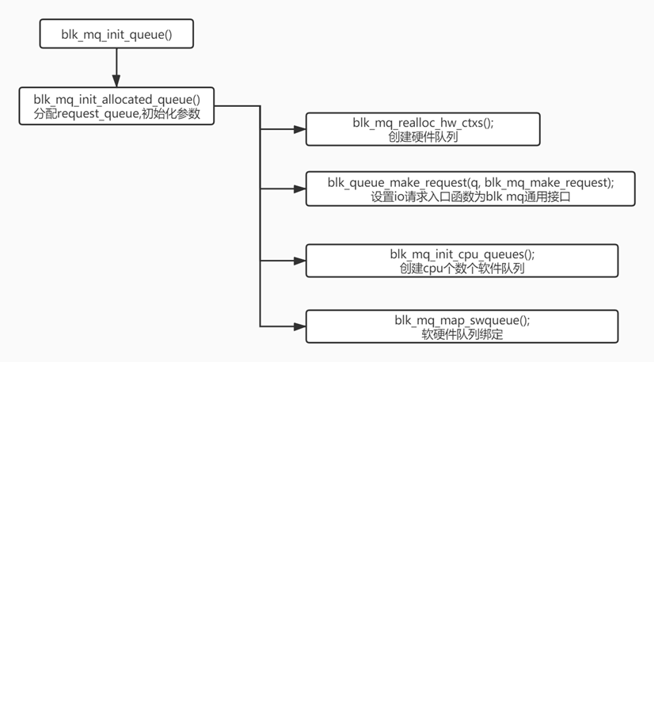

# blk-multi-queue 代码文档

随着高速SSD的普及和性能提升，传统的Linux块设备层和IO调度器已经显得有些力不从心。这是因为传统的块设备层和IO调度器主要是为HDD设计的，而HDD的随机IO性能相对较差，吞吐量通常只有几百IOPS，延迟在毫秒级。因此，在HDD时代，系统的IO性能瓶颈主要在硬件层面，而不在内核层面。

然而，随着高速SSD的出现，SSD的性能大幅提升，其随机IO性能可以达到百万级甚至千万级IOPS，延迟也大幅降低至微秒级别。这使得传统的块设备层和IO调度器逐渐成为系统IO性能的瓶颈。因此，为了充分发挥高速SSD的性能优势，需要对Linux内核的IO子系统进行优化和改进，以更好地适应高速SSD的特性，提供更高效的IO处理能力。

## 数据结构

除了在block层中介绍过的BIO外，multiqueue中还有一些需要了解的数据结构：

### request

IO调度的最小单元，描述一段物理地址连续的IO请求，对应一个或者多个连续的bio。操作类型，作用磁盘，优先级等数据由相关的bio转换而来，还包含了调度器及软硬件队列管理request时需要使用的链表节点结构。

```c
struct request {
    struct request_queue *q;        //所属的request_queue
    struct blk_mq_ctx *mq_ctx;        //所属的软件队列
    struct blk_mq_hw_ctx *mq_hctx;    //所属的硬件队列

    unsigned int cmd_flags;     /* op and common flags */
    req_flags_t rq_flags;

    int tag;
    int internal_tag;

    /* the following two fields are internal, NEVER access directly */
    unsigned int __data_len;    /* total data len */   //所有bio请求数据之和 
    sector_t __sector;      /* sector cursor */    //请求的起始扇区，等于第一个bio的起始扇区

    struct bio *bio;        //起始bio
    struct bio *biotail;   

    struct list_head queuelist;    //用于在各个队列链表中索引排序
    ...
    ...
}
```

### request_queue

这是一个庞大的数据结构，用于描述块设备的请求队列，创建块设备时通常调用blk_mq_init_queue()初始化。其中包含该块设备的软硬件队列，调度器，为上层提供的IO请求入口函数，各种限制参数。

```c
struct request_queue {
    struct request      *last_merge;
    struct elevator_queue   *elevator;    //调度器

    struct blk_queue_stats  *stats;
    struct rq_qos       *rq_qos;

    make_request_fn     *make_request_fn;    //io请求入口函数
    dma_drain_needed_fn *dma_drain_needed;

    const struct blk_mq_ops *mq_ops;    //驱动层需要实现的操作集合

    /* sw queues */
    struct blk_mq_ctx __percpu  *queue_ctx;    //每个cpu分配一个软件队列
    unsigned int        nr_queues;

    unsigned int        queue_depth;

    /* hw dispatch queues */
    struct blk_mq_hw_ctx    **queue_hw_ctx;    //硬件队列
    unsigned int        nr_hw_queues;        //硬件队列数量与硬件及驱动相关，目前大部分存储设备是1
    ...
    ...
    /*
        * queue settings
        */
    unsigned long   nr_requests;    /* Max # of requests */
    ...
    ...
    struct queue_limits limits;    //根据底层驱动的limits设置
    ...
    struct list_head    requeue_list;
    ...
    struct blk_mq_tag_set   *tag_set;    //描述底层硬件
    struct list_head    tag_set_list;
    struct bio_set      bio_split;
    ...
    ...
}
```

### blk_mq_hw_ctx

描述硬件队列，创建request_queue时在blk_mq_init_allocated_queue()中初始化。主要记录了其关联的软件队列，分配及管理rq的blk_mq_tags，以及一些调度用到的状态数据。

```c
struct blk_mq_hw_ctx {
    struct {
        spinlock_t      lock;
        struct list_head    dispatch;    //存放等待派发的rq
        unsigned long       state;  /* BLK_MQ_S_* flags */
    } ____cacheline_aligned_in_smp;

    struct delayed_work run_work;       //处理IO的工作队列
    ...
    void                *sched_data;        //调度器使用的私有数据，目前只有kyber用到
    struct request_queue    *queue;     //所属的request_queue
    ...
    struct sbitmap      ctx_map;        //用于标识当前硬件队列在处理哪些软件队列的rq,仅在不设置调度器时使用

    struct blk_mq_ctx   *dispatch_from;   //记录上一次dispatch派发的软件队列,仅在不设置调度器时使用
    unsigned int        dispatch_busy;    //记录当前是否busy,仅在不设置调度器时使用

    unsigned short      type;
    unsigned short      nr_ctx;       //关联软件队列数量
    struct blk_mq_ctx   **ctxs;       //关联软件队列链表
    ...
    struct blk_mq_tags  *tags;            //继承底层硬件
    struct blk_mq_tags  *sched_tags;      //有设置调度器时使用
    ...
    unsigned int        numa_node;
    unsigned int        queue_num;      //在request_queue硬件队列链表的编号

    atomic_t        nr_active;
    ...
    ...
}
```

## blk-multiqueue 流程

### 各队列初始化

块设备初始化时通过blk_mq_init_queue()创建request_queue并初始化,主要功能包含：

1. request_queue与块设备的blk_mq_tag_set相互绑定，根据blk_mq_tag_set设置一些参数。  
2. 创建软硬件队列及进行绑定。  
3. 设置io请求入口函数make_request_fn 为 blk_mq_make_request()。  



IO请求的入口为blk_mq_make_request()，其中首先判断IO是否可以跟其他request合并，若无法合并再将IO转换为request进一步处理。

### Block层BIO下派到multi-queue队列请求


blk_mq_get_request() —— 从提前分派好的requests中获取一个新的请求


IO在blk_mq_make_request()中转换成request后，根据不同情况做处理，最终去向主要有三种：加入plug队列，加入调度队列，直接派发。


### Multi-queue队列请求下派到驱动程序

blk_mq_run_hw_queue() 用来启动一个硬件队列的request派发，触发派发的情况很多，大致归纳下是：需要直接处理request，plug/调度队列flush，硬件队列启动/停止，blk_mq_get_tags中获取不到tags，kyber_domain_wake等等。


### [【调用栈分析】](./mq_call_stack.c)
