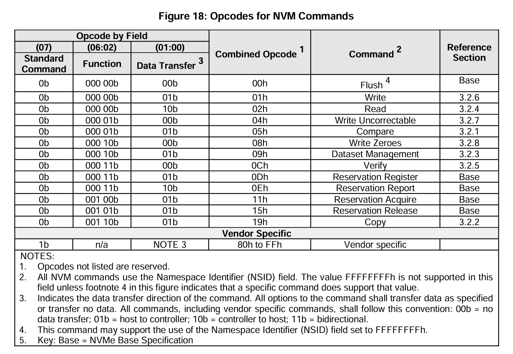
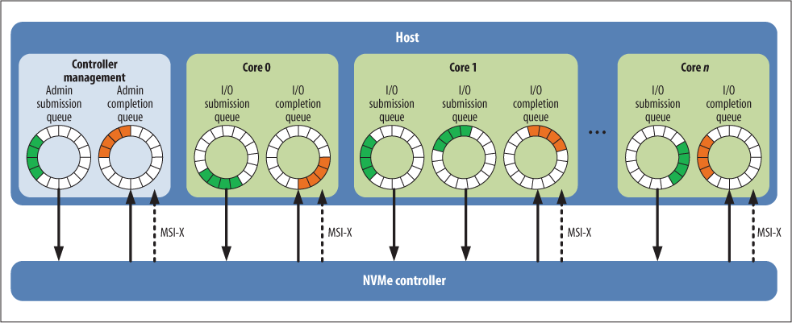

# NVMe 解读

针对项目中指定的NVMe存储协议进行解读

NVMe（Non-Volatile Memory Express）是一个开放的标准集合和信息体系，旨在充分发挥非易失性存储器在从移动设备到数据中心的各种计算环境中的优势。

## 设计和目的

NVM Express 标准包括：

1. NVM Express（NVMe）规范：PCI Express 技术连接的存储器的寄存器接口和命令集，具有多种操作系统的行业标准软件支持。NVMe 被广泛认为是 PCIe 固态硬盘的行业标准。
2. NVMe 管理接口（NVMe-MI）规范：用于对 NVM Express 存储进行带外管理的命令集和体系结构（例如，使用 BMC 发现、监控和更新 NVMe 设备）。
3. NVMe 引导规范：概述了通过 NVM Express 接口引导的标准过程，并定义了预操作系统环境（例如，BIOS）与操作系统共享 NVMe 传输的管理配置的机制。
4. NVMe 命令集规范：各自的命令集规范允许 NVM Express 针对新兴技术（例如分区命名空间、键值存储和最终的计算存储）进行隔离和独立演进。
5. NVMe 传输规范：各自的传输规范允许 NVM Express 隔离和独立演进内存和传输传输的新兴技术。

这些设计旨在为当前和未来的非易失性存储器技术提供高带宽和低延迟的存储访问。

## NVMe Command

NVMe Host（Server）和NVMe Controller（SSD）都是通过NVMe Command进行信息交互。NVMe Spec中定义了NVMe Command的格式，可以看到，NVMe Command占用64字节。其中Command的前4个字节规定如下：



NVMe Command又分为Admin Command和IO Command，前者主要是用于配置，后者用于数据传输。

## 处理IO请求

在机械硬盘统治天下的时代，由于其随机访问性能差，Linux内核开发者把重点放在缓存I/O, 合并I/O等方面，并没有考虑多队列的设计；Flash的出现改变了这一切，Flash的低延迟，高并发潜质急需一种新的内核协议栈来发挥其潜能，NVMe解决了这个问题。

### NVMe 队列

NVMe的队列分为两种类型。首先是用于管理的队列，称为管理队列（Admin Queue），每个NVMe设备只有一个管理队列。其次是命令队列（Command Queue），每个NVMe设备最多可以支持65535个命令队列。管理队列负责设置命令队列的数量和模式。

每个命令队列实际上包含两个队列：提交队列（Submission Queue）和完成队列（Completion Queue）。提交队列用于主机端向NVMe设备发送NVMe命令，而完成队列则用于NVMe设备向主机端反馈命令的执行情况。



### 通过Submission Queue提交IO请求

在Block层下发的IO请求通常以BIO的形式表示。然而，需要注意的是，BIO存放在普通的内核线程空间中，而DMA地址是不能直接用线程的虚拟空间地址表示的。因此，我们不能简单地使用dma_alloc_coherent函数来分配DMA地址并将BIO中的数据拷贝到该地址上。相反，Linux提供了dma_map_single函数，可以将虚拟空间地址（即BIO数据存放地址）转换为DMA可用地址，并且可以通过scatterlist来表示多个IO请求的DMA地址。

一旦有了DMA地址，就可以将BIO封装成NVMe Command发送出去。但在这个过程中，可能会对Command进行拆分或放入等待队列中。每个CPU都会被分配一个Queue，当I/O请求到来时，应该由当前线程运行的CPU所属的Queue来存放这个Command，以确保Queue不被其他Core抢占。驱动使用get_cpu()函数获取当前处理I/O请求的CPU号，以索引对应的Queue。

```c
struct nvme_queue* get_nvmeq(struct nvme_dev *dev)
{
    return dev->queues[get_cpu() + 1];
}
```

封装成的Command会顺序存入Submission Queue中。Submission Queue中的Tail表示最后操作的Command索引（即nvmeq->sq_tail）。每存入一个Command，主机就会更新Queue对应的Doorbell寄存器中的Tail值。Doorbell寄存器位于BAR空间，可以通过QID索引到（详情请参见附录）。值得注意的是，NVMe没有规定Command存入队列的执行顺序，因此Controller可以一次性取出多个Command进行批量处理，导致一个队列中的Command执行顺序不固定（可能会导致先提交的请求后处理）。

SSD控制器根据Doorbell的值获取NVMe命令及其对应的数据，然后在处理完成后将结果存入完成队列中。控制器通过中断方式通知主机，驱动为每个队列分配一个MSI/MSI-X中断。创建NVMe队列时，调用pci_enable_msix函数向pdev申请nr_io_queues个中断，然后将中断信息存入dev->entry中，其中dev->entry是msix_entry类型的数据结构。这里，vector用于内核标识中断号，entry由驱动程序管理，主要用于索引中断号，被称为Index_irq。

驱动程序使用request_irq函数将所有的dev->entry[Index_irq].vector注册到内核，并将中断处理函数nvme_irq绑定到这些中断上。在中断处理函数中，首先从完成队列中取出完成的命令，然后将队列的头值加1，并调用上层的回调函数（用于完成BIO处理）。由于NVMe命令可以批量处理，因此这里使用for循环来处理所有新的完成命令。
