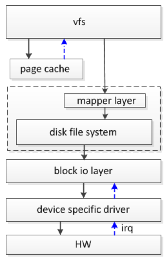
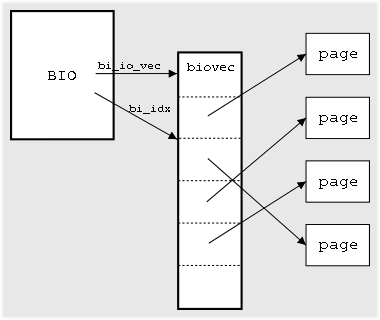

# Linux块层框架

## 块层抽象层次

用户发起读写操作时，并不是直接操作存储设备，而是需要经过较长的 IO 栈才能完成数据的读写。读写操作大体上需依次经过虚拟文件系统 vfs、磁盘文件系统、block 层、设备驱动层，最后到达存储器件,器件处理完成后发送中断通知驱动程序。

上层：虚拟文件系统和映射层

下层：块设备驱动程序



块层的主要目的和作用有：

1. **抽象存储设备**：
   块层提供了一个抽象层，使得操作系统可以统一管理各种不同类型的存储设备，如硬盘驱动器（HDD）、固态硬盘（SSD）、光盘驱动器等。通过块层，操作系统可以将这些存储设备抽象成一个个的块设备，以便进行统一的访问和管理。

2. **提供块级别的访问接口**：
   块层向上层提供了块级别的访问接口，使得应用程序和文件系统可以以块为单位进行数据的读写操作。这种以块为单位的访问方式相比字节级别的访问更高效，尤其适用于大容量数据的读写操作。

3. **提供缓存机制**：
   块层通常会在内存中维护一个块缓存（Block Cache），用于缓存磁盘上的数据块，以加速对数据的访问。通过缓存机制，块层可以提高系统的读写性能，并减少对磁盘的频繁访问，从而降低了磁盘的负载。

4. **提供I/O调度和请求合并**：
   块层负责对来自应用程序和文件系统的I/O请求进行调度和合并，以优化磁盘的访问顺序和提高磁盘的吞吐量。通过合理的I/O调度算法和请求合并策略，块层可以降低磁盘的访问延迟，提高系统的响应速度。

5. **提供错误处理和容错机制**：
   块层还负责监控存储设备的状态，并提供相应的错误处理和容错机制。当存储设备发生故障或错误时，块层会进行相应的处理，以保证系统的稳定性和数据的完整性。

## 重要结构体

### BIO

bio结构体是内核中块I/O的基本容器，定义在\<linux/bio.h\>中， 它描述一次IO操作，收集底层组件需要的所有信息以满足所发出的的请求。该结构将正在活动的块I/O操作表示为段列表，段是内存中连续的缓冲区块（请注意，不同段不一定是连续的），通过允许以块的形式描述缓冲区，bio 结构为内核提供了从内存中的多个位置执行单个缓冲区的块 I/O 操作的能力。



```c
struct bio {
        struct bio          *bi_next;   /* request queue link */
        struct block_device *bi_bdev;
        unsigned int        bi_flags;   /* status, command, etc */
        int                 bi_error;
        unsigned long       bi_rw;      /* 末尾 bit 表示 READ/WRITE,
                                         * 起始 bit 表示优先级
                                         */
        struct bvec_iter    bi_iter;    /* current index into bio_vec array */

        /* 当完成物理地址合并之后剩余的段的数量 */
        unsigned int        bi_phys_segments;

        /*
         * To keep track of the max segment size, we account for the
         * sizes of the first and last mergeable segments in this bio.
         */
        unsigned int        bi_seg_front_size;
        unsigned int        bi_seg_back_size;

        /* 关联 bio 的数量 */
        atomic_t            __bi_remaining;
        bio_end_io_t        *bi_end_io;
        void                *bi_private;
        unsigned short      bi_vcnt;    /* how many bio_vec's */

        /*
         * Everything starting with bi_max_vecs will be preserved by bio_reset()
         */
        unsigned short      bi_max_vecs;    /* max bvl_vecs we can hold */
        /* 当前 bio 的引用计数，当该数据为 0 时才可以 free */
        atomic_t            __bi_cnt;       /* pin count: free when it hits zero */
        struct bio_vec      *bi_io_vec;     /* the actual vec list */
        struct bio_set      *bi_pool;

        /*
         * We can inline a number of vecs at the end of the bio, to avoid
         * double allocations for a small number of bio_vecs. This member
         * MUST obviously be kept at the very end of the bio.
         * 表示跟在 bio 后面的数据集合
         */
        struct bio_vec      bi_inline_vecs[0];
};

struct bvec_iter {
        sector_t        bi_sector;      /* device address in 512 byte sectors */
        unsigned int    bi_size;        /* residual I/O count */
        unsigned int    bi_idx;         /* current index into bvl_vec */
        unsigned int    bi_bvec_done;   /* number of bytes completed in current bvec */
};

```

### 请求队列

块设备会将挂起的块I/O请求保存在请求队列中，该队列由 `request_queue` 结构体表示，定义在 `<linux/blkdev.h>` 中，包含一个双向请求链表以及相关控制信息。高层的内核代码（如文件系统）会将请求添加到队列中。只要请求队列不为空，队列对应的块设备驱动程序就会从队列头获取请求，并将其传输到对应的块设备上。请求队列中的每一项都是一个单独的请求，由 `request` 结构体表示。

在请求队列中，每个请求由 `request` 结构体表示，该结构体定义在 `<linux/blkdev.h>` 中。一个请求可能需要操作多个连续的磁盘块，因此每个请求可以由多个 `bio` 结构体组成。需要注意的是，虽然磁盘上的块必须是连续的，但在内存中这些块并不一定要连续。

## BIO提交之前的调度

内核在提交请求前，先执行名为合并与排序的预操作。在内核中负责提交I/O请求的子系统称为I/O调度程序。I/O调度程序将磁盘I/O资源分配给系统中所有挂起的块I/O请求。进程调度程序和I/O调度程序都是将一个资源虚拟给多个对象，对进程调度程序来说，处理器被虚拟并被系统中的运行进程共享。这种虚拟提供给用户的就是多任务和分时操作系统，像Unix系统。I/O调度程序虚拟块设备给多个磁盘请求，以降低磁盘寻址时间。

1. **Linus电梯**：
   - 在队列中执行操作，包括合并相邻请求、防止饥饿、按扇区方向排序等。

2. **最后期限I/O调度程序**：
   - 维护排序队列，按照请求类型插入不同的FIFO队列，执行合并和插入操作。
   - 设置超时时间，根据超时从FIFO队列中提取请求服务。

3. **预测I/O调度程序**：
   - 基于最后期限I/O调度程序，增加了预测能力，延迟处理以等待相邻磁盘位置操作的请求。
   - 通过跟踪和统计应用程序的I/O操作行为，预测未来行为。

4. **完全公平的排队I/O调度程序 (CFQ)**：
   - 根据进程组织I/O请求，放入相应队列，采用时间片轮转调度队列中的请求。

5. **空操作的I/O调度程序 (Noop)**：
   - 专为随机访问设备设计，如闪存卡。
   - 不进行排序和预寻址操作，仅进行合并操作，维护请求队列近乎FIFO顺序排列。

6. **I/O调度程序的选择**：
   - 默认使用完全公平的I/O调度程序。
   - 可以通过命令行选项来覆盖默认设置，选择其他激活的I/O调度程序。

## BIO在块层中的流程（调用栈）

[调用栈分析](./block_layer_call_stack.c)